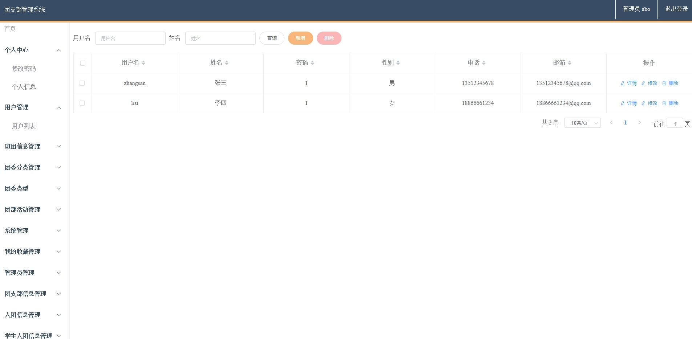
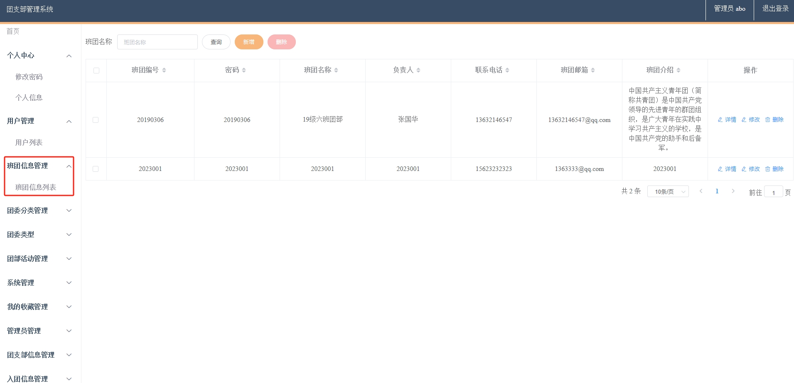
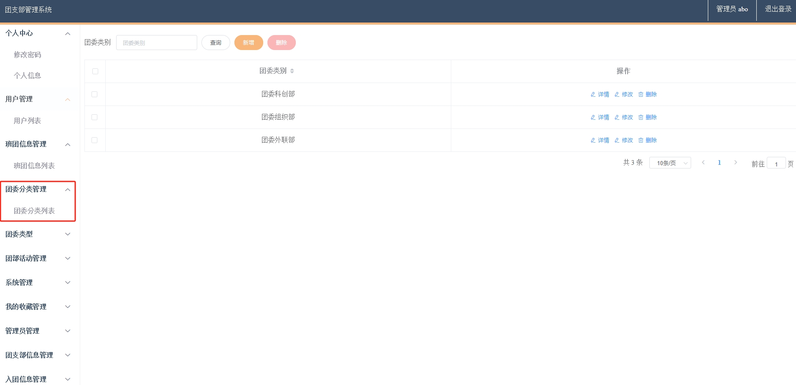
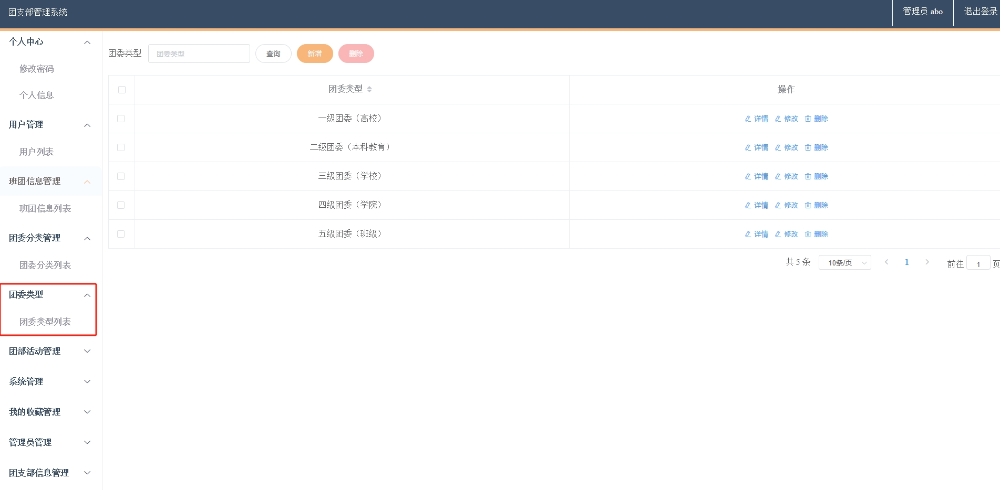
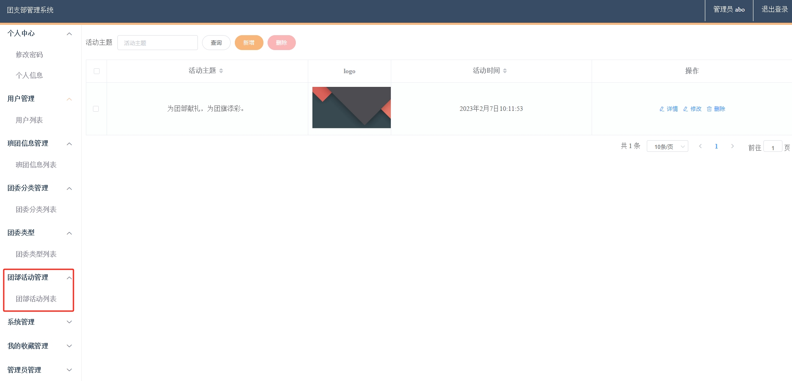

# 1.项目介绍
- 功能模块:普通用户(入团申请,留言板,转团申请,个人信息), 团支部管理员（注册管理、团委分类、团支部信息管理、入团信息管理、留言板管理、团员管理等），超级管理员（具有所有权限）
- 技术栈：SpringBoot，shiro，hutool，fastjson，MyBatis，vue
- 测试环境：idea2024，MySQL5.7，Navicat，Maven3
# 2.项目部署
- 通过navicat创建数据库，导入db目录下的sql
- 根据本地数据库环境，修改数据库连接信息：src/main/resources/application.yml  11-14行
- 将压缩包内的my复制到电脑的D盘下（如果没有D盘，那么就复制到别的盘，需要修改com/controller/FileController.java 54行，com/config/InterceptorConfig.java 36行）
- 启动项目
- 管理web：http://localhost:8080/springbootjlvpC/admin/dist/index.html  账号密码：abo/1
- 门户web：http://localhost:8080/springbootjlvpC/front/index.html  其他角色账号密码自行查找数据库
# 3.项目部分截图

# 4.获取方式
[戳我查看](https://gitee.com/aven999/mall)